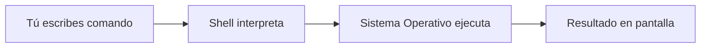

:::exercise{title="Primeros comandos" difficulty="1"}

Antes de empezar Bandit, verifica que tu terminal funciona:

1. Abre tu terminal (Ubuntu en WSL2, Terminal en Mac, o tu terminal de Linux)
2. Ejecuta `whoami` y anota tu nombre de usuario
3. Ejecuta `pwd` y anota en qué directorio estás
4. Ejecuta `echo "Hola desde la terminal"` y observa el resultado

**Estos comandos te servirán para Bandit.**

:::

# Conceptos Básicos de la Terminal


## ¿Qué es la Terminal?

La **terminal** (también llamada consola o línea de comandos) es una interfaz de texto para comunicarte con tu computadora. En lugar de hacer clic en íconos, escribes comandos.




## Terminal vs Shell: ¿Cuál es la diferencia?

| Concepto | Qué es | Ejemplo |
|----------|--------|---------|
| **Terminal** | El programa/ventana donde escribes | Terminal.app, iTerm2, Windows Terminal |
| **Shell** | El intérprete que procesa tus comandos | Bash, Zsh, Fish |

Piensa en la terminal como el teléfono y el shell como el idioma que hablas.

### Shells comunes

- **Bash** (Bourne Again Shell): El estándar en Linux y WSL2
- **Zsh**: Default en macOS (muy similar a Bash)
- **Fish**: Más amigable pero menos común

> Para este curso, los comandos funcionan igual en Bash y Zsh.

---

## Tu Primera Interacción

Cuando abres la terminal, ves algo como esto:

```bash
usuario@computadora:~$
```

Esto se llama el **prompt** y te dice:

| Parte | Significado |
|-------|-------------|
| `usuario` | Tu nombre de usuario |
| `@` | Separador |
| `computadora` | Nombre de tu máquina |
| `:` | Separador |
| `~` | Directorio actual (~ = tu carpeta home) |
| `$` | Listo para recibir comandos (# si eres root/admin) |

---


## Anatomía de un Comando

Un comando tiene esta estructura:

```
comando [opciones] [argumentos]
```

### Ejemplos

```bash
# Solo comando
pwd

# Comando + argumento
cd Documents

# Comando + opción
ls -l

# Comando + opción + argumento
ls -la Documents

# Comando + múltiples opciones
ls -l -a -h
# Equivalente a:
ls -lah
```

### Opciones comunes

| Formato | Significado |
|---------|-------------|
| `-h` | Opción corta (una letra) |
| `--help` | Opción larga (palabra completa) |
| `-la` | Múltiples opciones cortas combinadas |

---

## Comandos Esenciales para Empezar

### `whoami` - ¿Quién soy?

```bash
whoami
# Resultado: tu_usuario
```

### `pwd` - ¿Dónde estoy?

**P**rint **W**orking **D**irectory - muestra tu ubicación actual.

```bash
pwd
# Resultado: /home/tu_usuario
```

### `echo` - Imprimir texto

```bash
echo "Hola mundo"
# Resultado: Hola mundo

echo $USER
# Resultado: tu_usuario (imprime el valor de una variable)
```

### `clear` - Limpiar pantalla

```bash
clear
```

> **Tip:** También puedes usar `Ctrl + L` para limpiar la pantalla.

### `date` - Fecha y hora

```bash
date
# Resultado: Thu Jan 23 10:30:00 CST 2026
```

### `cal` - Calendario

```bash
cal
# Muestra el calendario del mes actual
```

---

## Obtener Ayuda

### `--help` - Ayuda rápida

```bash
ls --help
```

### `man` - Manual completo

```bash
man ls
```

Dentro del manual:
- `q` para salir
- `↑/↓` o `j/k` para navegar
- `/palabra` para buscar

### `tldr` - Ejemplos prácticos (instalar aparte)

```bash
tldr ls
# Muestra ejemplos comunes de uso
```

---

## Errores Comunes

### "command not found"

```bash
$ pythno
bash: pythno: command not found
```

**Causa:** El comando no existe o está mal escrito.  
**Solución:** Revisa la ortografía (`python` no `pythno`).

### "Permission denied"

```bash
$ ./script.sh
bash: ./script.sh: Permission denied
```

**Causa:** No tienes permisos para ejecutar.  
**Solución:** Aprenderás sobre permisos más adelante.

### "No such file or directory"

```bash
$ cd carpeta_que_no_existe
bash: cd: carpeta_que_no_existe: No such file or directory
```

**Causa:** La ruta no existe.  
**Solución:** Verifica que escribiste bien el nombre.

---

## Cancelar un Comando

Si un comando se queda corriendo o quieres cancelar:

| Atajo | Acción |
|-------|--------|
| `Ctrl + C` | Cancela el comando actual |
| `Ctrl + D` | Cierra la terminal (EOF) |
| `Ctrl + Z` | Suspende el comando (cuidado, sigue en memoria) |

:::exercise{title="Prueba cancelar" difficulty="1"}

1. Ejecuta `sleep 100` (espera 100 segundos)
2. Presiona `Ctrl + C` para cancelarlo
3. Observa cómo vuelve el prompt

:::

---

---

## Ejercicios Prácticos

:::exercise{title="Exploración inicial" difficulty="1"}

Ejecuta estos comandos y anota qué hace cada uno:

```bash
whoami
hostname
pwd
date
cal
uptime
```

**Pregunta:** ¿Cuánto tiempo lleva encendida tu computadora?

:::

:::exercise{title="Usando opciones" difficulty="1"}

Experimenta con opciones:

```bash
# Sin opciones
date

# Con opción de formato
date +"%Y-%m-%d"

# Solo hora
date +"%H:%M:%S"
```

**Pregunta:** ¿Qué significa `%Y`, `%m`, `%d`?

:::

:::exercise{title="Obtener ayuda" difficulty="2"}

1. Ejecuta `man ls` y encuentra:
   - ¿Qué hace la opción `-h`?
   - ¿Qué hace la opción `-S`?
2. Sal del manual con `q`
3. Prueba `ls --help | less` para ver la ayuda con scroll

:::

---

## Prompts para LLM

Cuando te atores o quieras profundizar, usa estos prompts:

:::prompt{title="Entender un error" for="ChatGPT/Claude"}

Estoy aprendiendo a usar la terminal de Linux. Ejecuté este comando:

```
[pega tu comando aquí]
```

Y obtuve este error:

```
[pega el error aquí]
```

¿Qué significa este error y cómo lo soluciono?

:::

:::prompt{title="Explicar un comando" for="ChatGPT/Claude"}

Explícame qué hace este comando de terminal paso a paso, como si fuera principiante:

```
[pega el comando aquí]
```

Desglosa cada parte: el comando base, las opciones y los argumentos.

:::

---

## Resumen

| Concepto | Descripción |
|----------|-------------|
| Terminal | Ventana donde escribes comandos |
| Shell | Intérprete (Bash, Zsh) |
| Prompt | Indicador que espera tu comando |
| Comando | Instrucción + opciones + argumentos |
| `Ctrl + C` | Cancelar comando |
| `Ctrl + L` | Limpiar pantalla |
